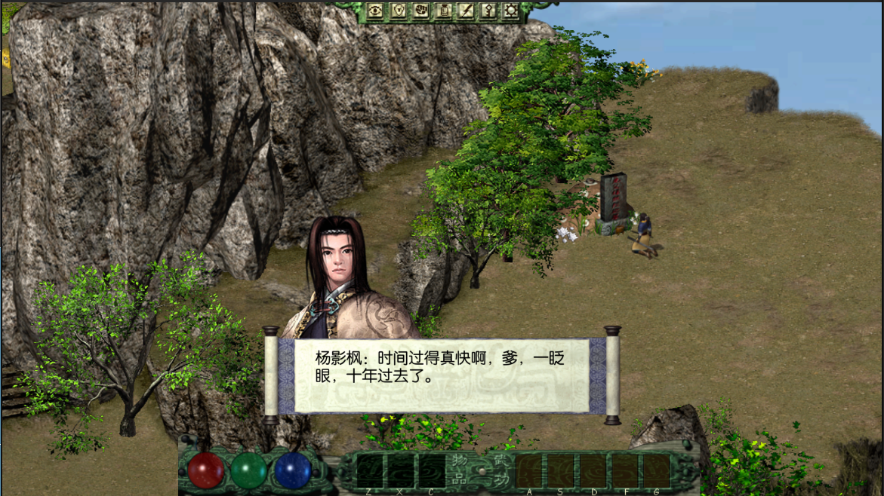

# 剑侠情缘外传：月影传说 Unity 6 复刻工程

这是一个基于 Unity 6 的《剑侠情缘外传：月影传说》复刻工程，目标是在现代环境中忠实还原原作的剧情、战斗、数值、流程与演出，并在此基础上完成适合现代 Unity 工作流的本土化整理。

> 本项目仅用于学习、研究与技术交流。Git 仓库不包含原游戏美术、音频、视频等资源；运行游戏所需资源必须由使用者单独获取并导入。

## 运行截图



## 下载

- [Windows x64 IL2CPP 体验包](https://github.com/xiayu519/YueYing-RE-Unity6/releases/download/windows-il2cpp-20260810/JxqyHD-Windows-x64-IL2CPP-20260810.zip)：下载后解压，运行 `JxqyHD.exe`。
- [开发者资源包（百度网盘下载信息）](https://github.com/xiayu519/YueYing-RE-Unity6/releases/download/windows-il2cpp-20260810/JxqyResources-20260810-BaiduNetdisk.txt)：TXT 内含 `JxqyResources-20260810.unitypackage` 的百度网盘链接、提取码和 SHA256。

Windows 体验包 SHA256：

```text
6BC93866F4E59F0F1390EEB834D1AAE4CE32CAE50758A2A40D0BF6E56CE2EFAF
```

## 开发环境

- Unity `6000.5.4f1`
- Windows 10/11
- YooAsset `EditorSimulateMode`

## 首次运行

1. 克隆本仓库。
2. 使用 Unity Hub 打开 `01-CleanProject/UnityProject`。
3. 将单独下载的 `JxqyResources-20260810.unitypackage` 完整导入工程。
4. 等待 Unity 完成资源导入和脚本编译。
5. 双击 `01-CleanProject/SetupResources.bat`。
6. 确认窗口显示 `SimulationManifest=Refreshed` 和 `BundleBuild=Skipped`。
7. 打开 `Assets/Scenes/main.unity`，点击 Play。

配置脚本只刷新 `DefaultPackage` 与 `JxqyPackage` 的 YooAsset 编辑器模拟清单，不构建真实 AssetBundle、不生成 `StreamingAssets`，也不打包玩家程序。

## 仓库内容

公开仓库只包含可维护和运行所必需的 Unity 工程代码与配置。以下内容不会提交到 Git：

- 原游戏资源及导入后的 `Assets/AssetRaw/Jxqy`
- Windows IL2CPP 体验包
- Unity `Library`、`Temp`、`Logs`、`Bundles`、构建产物
- Codex、Claude、OpenSpec 等代理或规格工作目录
- 完整保底工程中的内部验证脚本和交付工具

## 致谢

衷心感谢以下开源项目与前人的探索，为这个复刻工程提供了宝贵的技术基础和实现参考：

- [TEngine](https://github.com/Alex-Rachel/TEngine)：本项目使用的 Unity 开发框架。
- [JxqyHD](https://github.com/mapic91/JxqyHD)：《月影传说》的第一个开源复刻版本，为原作逻辑与资源组织研究提供了重要参考。
- [miu2d](https://github.com/luckyyyyy/miu2d)：第二个复刻版本，以不同技术路线延续了对经典国产武侠游戏的探索。

最后，特别感谢西山居创造了《剑侠情缘外传：月影传说》。那些江湖、人物、音乐与故事承载了我童年最珍贵的一部分记忆；感谢你们曾带来这样一段美好的时光，也让多年后的重逢依然充满感动。

## 版权说明

《剑侠情缘外传：月影传说》及其相关名称、角色、美术、音乐和其他原始内容的权利归其合法权利人所有。本项目与西山居及相关权利人不存在官方隶属或授权关系，请勿将本项目或配套资源用于商业用途。
